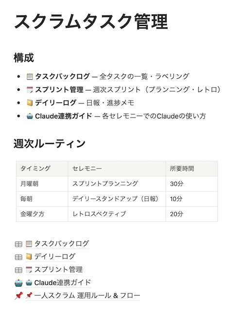
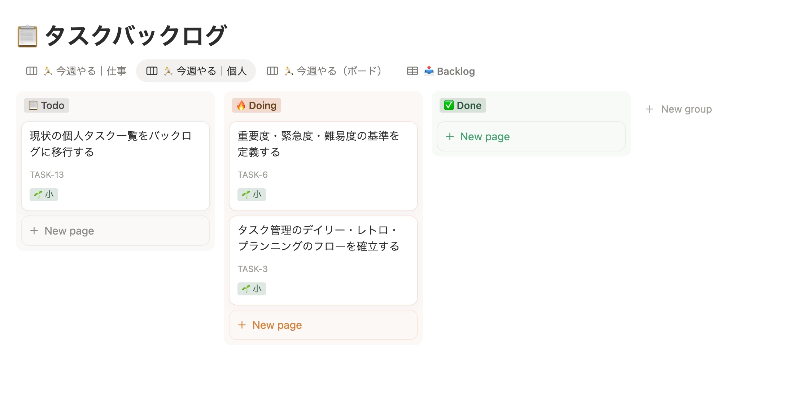
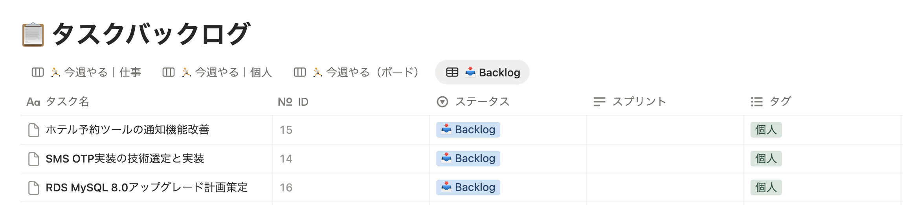

## はじめに

自分はエンジニアですが、最近は開発以外のタスクも増えてきました。
元々面倒なことを後回しにしがちで、「そろそろこのクセを治さないといつまで経ってもやるべきことが前に進まないな...」
と悩みを抱えていました。

そこで技術顧問の方に相談したところ、タスクの整理が課題だからスクラムみたいに管理してみてはどうかとアドバイスをもらって、ClaudeとNotionを使ってスクラムっぽいタスク管理をやってみることにしました。
実際にやってみた内容を紹介します。

---

## こんな人におすすめ

- TODOリストが肥大化している人
- 優先順位を決めるのが苦手な人
- タスク管理が続かない人
- ClaudeやNotionをもっと活用したい人

---

## 今までのやり方の課題

今までTODOリストでタスク管理をしていたが、以下の課題があった。

- リストが肥大化して、邪魔な情報が多くなる
- 差し込みタスクがあるたびにどこに入れるか迷う
- 面倒なタスクは下の方に入れがち

結果として、難易度が低いタスクから手をつけてしまって、重要なのに面倒なやつは永遠に後回しになる。

---

## 考えた仕組み

### Claudeを秘書として使い、Notionに記録させる

ClaudeにNotion MCPを組み込み自由に読み書きできる前提で進める。
Claudeには秘書になってもらい、NotionやGoogleカレンダーを操作してもらう。

- タスクを預けると重要度・緊急度・難易度を判断してラベリング
- 「今週何やる？」と聞くとバックログを見渡して優先順位をつけてリストアップ
- カレンダーを確認して、今日の空き時間にタスクを割り当ててスケジュールを組んでくれる
- 割り込みが入ったら「今週のどれを後回しにすべきか」を提案してくれる
- 今週の振り返りをKPT形式でまとめてくれる

自分は「何をやりたいか」だけ伝えて、「それをいつやるか」「他の何と比べて優先するか」はClaudeに提案させる感じ。

### 見えるタスクを絞る

人間が同時に意識できるタスクには限界があるので、それ以上あると頭がパンクして優先度の判断が崩れる。
だから「今週やること」を最大10件に絞ってそれ以外は視界から消すことにした。

### タスクにラベルをつける

タスクにはそれぞれ重要度・緊急度・難易度の軸で高中低のラベルをつける。

**「難易度が小さいから先にやる」は罠。** 手をつけやすいだけで、重要じゃないタスクを先にやっても意味がない。

### 週次のリズムを作る

スクラムっぽく、週単位でリズムを作る。

- **月曜：プランニング** → 今週やる10件を選ぶ
- **毎朝：デイリー** → 今日やることを決めてカレンダーに入れる
- **金曜：レトロ** → KPTで振り返って次週に活かす

---

## やってみた
まずは雑に投げてみた。(めんどくさがりなので)

```
こんな感じの課題感があって、手伝ってほしい

優先順位を明確にする必要がある
緊急度低い・重要度低い→難易度低いからといって先にやらないほうがいい
面倒くさいことから逃げがち→仕組みで解決するしかない

claudeつかって以下をやってみる
重要度緊急度難易度のラベリングする
ワーキングメモリに入る分のタスクだけ見えるようにする
自分で週一スプリントのスクラムやってみる→ プランニング・デイリー(自分日報)・レトロ

notionを使って以下の仕組みを構築したい
```

すると、ヒアリングに答えただけで以下のページを早速作ってくれた。



追加でルールをいくつか足して、ボードとBacklogを整えた。

- 優先度ラベリングの基準を追加
- TASK-IDを自動採番（プランニングでタスク名を打たなくていいように）
- 親子関係（大きいタスクをサブタスクに分解できる）
- 仕事と個人のタグを振り分ける（仕事とプライベートは別々のボードだが指示は一回で出来るように）

出来たNotionDB一覧がこちら

① タスクバックログ
- 重要度・緊急度・難易度・優先スコア・タグ（仕事/個人）
- 進行状況（📋 Todo / 🔥 Doing / ✅ Done）

ビューは以下の使い分け

- 🏃 今週やる｜仕事：仕事タスクのKanbanボード
- 🏃 今週やる｜個人：個人タスクのKanbanボード



- 📥 Backlog：優先スコア順テーブル（プランニング用）



② スプリント管理
- スプリント名・ゴール・KPT・達成率

③ デイリーログ
- 今日やること
- カレンダービューで日ごとに振り返る

あとは、チャットベースでタスクを追加したり、スクラムを回す。

**タスク登録**
「タスク追加：〇〇」と言うだけで、Claudeがラベリングしてバックログに保存してくれる。タグを指定しなければコンテキストから推定して提案してくれる。

**プランニング（月曜）**
「今週のプランニングお願いします」と言うと、Claudeがバックログを取得して今週やる10件・あえてやらないこと・今週のゴールを提案してくれる。IDで返信するだけで確定する。

```
TASK-1, 3, 5, 8で
```

これだけで今週やるに入って、スプリントDBも自動で作られる。

**デイリー（毎朝）**
「今日やること：〇〇」を送ると、Claudeがカレンダーを参照して空き時間へのスケジュールを提案し、そのままカレンダーに登録してくれる。

**差し込みタスク**
スプリント中に割り込みが来たとき「差し込みが来た。どれを落とす？」と聞くと、今週のタスク一覧と比較して候補を1〜2件提案してくれる。

**レトロ（金曜）**
「今週の振り返りを手伝って」と言うと、ClaudeがNotionから今週のタスクデータを取得してDone/未完了を整理し、KPT形式でまとめてくれる。


## 最終的に出来たルール

```
## Notion構成

| DB / ページ | 役割 |
| --- | --- |
| 📋 タスクバックログ | 全タスクの登録・ラベリング・ステータス管理 |
| 🗓 スプリント管理 | 週次スプリントのゴール・KPT記録 |
| 📔 デイリーログ | 毎日の日報・ブロッカー・エネルギー記録 |

---

## タスクのラベリング基準

### 重要度

| ラベル | 基準 |
| --- | --- |
| 🔴 高 | 成果・目標・売上・チームに直結する |
| 🟡 中 | あると良いが直結はしない |
| 🟢 低 | やらなくてもOK、あとまわし可 |

### 緊急度

| ラベル | 基準 |
| --- | --- |
| 🔴 高 | 今週中に対応必須 |
| 🟡 中 | 今月中でよい |
| 🟢 低 | いつでもよい |

### 難易度

| ラベル | 基準 |
| --- | --- |
| 💪 大 | 4時間以上 |
| 👋 中 | 1〜4時間 |
| 🌱 小 | 1時間未満 |

### 優先スコア

重要度(高=3 / 中=2 / 低=1) × 緊急度(高=3 / 中=2 / 低=1) = 最大9点

---

## ステータス定義

### タスク全体ステータス

| ステータス | 意味 |
| --- | --- |
| 🧊 Ice Box | いつかやるかも。今は考えない |
| 📥 Backlog | 着手候補。プランニングで選ぶ対象 |
| 🏃 今週やる | スプリントにアサイン済み |
| ✅ Done | 完了 |
| 🚫 キャンセル | やらないことに決定 |

### 進行状況（今週やるタスクのみ）

| 進行状況 | 意味 |
| --- | --- |
| 📋 Todo | まだ着手していない |
| 🔥 Doing | 現在進行中 |
| ✅ Done | 完了 |

---

## ワーキングメモリルール

> **「今週やる」は最大10件まで**
> 

> 子タスクは親タスクの件数に含めてカウントしない
> 
- 重要度🔴 or 緊急度🔴 のタスクを優先して選ぶ
- 新規タスクの進行状況は必ず📋 Todoからスタート
- タスクが完了したら**ステータスはそのまま**にして、進行状況を✅ Doneに変更する（「TASK-X完了」と言えばClaudeが進行状況のみ更新する）
- 難易度🌱 だからといって先に選ばない
- 難易度💪 大のタスクは1週間まるごとアサインするか、サブタスクに分解してから入れる
- 10件を超えたらClaudeに削る判断を丸投げする

---

## 週次ルーティン

| タイミング | セレモニー | 所要時間 |
| --- | --- | --- |
| 月曜朝 | スプリントプランニング | 30分 |
| 毎朝 | デイリースタンドアップ（日報） | 10分 |
| 金曜夕方 | レトロスペクティブ | 20分 |

---

## 各セレモニーのフロー

### 🗓 スプリントプランニング（月曜）

1. Backlogのタスク一覧をClaudeに渡す
2. 「今週やる5件」「あえてやらないこと」「今週のゴール」を提案してもらう
3. IDで返信して確定（例：「TASK-1, 3, 5で」）
4. Claudeがステータスを「🏃 今週やる」に更新 + スプリントDB作成

### ☀️ デイリー（毎朝）

1. **今日やることだけ**を入力（昨日やったこと・ブロッカーは任意）
2. ClaudeがGoogleカレンダーを参照して、その日の空き時間にタスクを割り振る提案をする
3. OKであればGoogleカレンダーに予定として登録する
4. デイリーログDBに保存

**進行状況の更新（Todo → Doing → Done）は自分でNotionを操作する**

### 🌱 子タスクへの分解

1. 難易度💪大のタスクはサブタスクに分解してから「今週やる」に入れる
2. 「TASK-Xを親タスクにして、子タスクを追加して」と伝える
3. 子タスクは「親タスク」プロパティで結びつき、親タスクのページにリンクとして記載される
4. 進行状況はTodoスタート、着手時にDoing、完了時にDoneに変更

### 🚨 差し込みタスクが来たとき

1. 差し込みタスクの内容（名前・重要度・緊急度・難易度・理由）をClaudeに伝える
2. 今週のスプリントタスク一覧も共有
3. Claudeが「落としても良さそうなタスク」を1〜2件ピックアップして理由つきで提案
4. 判断してIDで返信 → Claudeがステータス更新

### 🔁 レトロスペクティブ（金曜）

1. 気づきやコメントを自由に伝える（ゴール・完了・未完了の入力は任意）
2. Claudeが「今週やる」タスクのNotionデータを取得してDone/未完了一覧を提示
3. KPT形式（Keep / Problem / Try）でまとめてもらう
4. 優先度逃げ・面倒先送りの傾向があれば指摘してもらう
5. スプリントDBのKPTを更新、ステータスを「✅ 完了」に変更

---

## タグルール

- タグは **「仕事」** と **「個人」** の2種類のみ
- タスク登録時に指定するのが基本。指定がない場合はClaudeがコンテキストから推定して提案する

---

## タスクID体系

- フォーマット：`TASK-{連番}`（例：TASK-1, TASK-8）
- Notionのタスクバックログに自動付番
- Claudeへの返信時はIDで指定できる（例：「TASK-3完了」「TASK-5をIce Boxに」）
```

---

## スプリントを回してみて

### 良い点

**タスク追加・プランニング・振り返りが楽**
- 「〇〇を仕事タグでタスク追加。今週の差し込み」みたいに雑に投げても解釈してくれる
- 「今週のプランニング」と言うだけで先週の持ち越しとBacklogのタスク一覧が見れて指示しやすい
- 「今週の振り返り」と言うだけで今週何が終わって何が未達か一覧で分かる

**ツールをまたいで動いてくれる**
Notion・Googleカレンダーなどの複数のツール間でのやり取りがスムーズ。

**スケジュールを組んでくれる**
デイリーでカレンダーを見てスケジュールを組んでくれる。「今日は15時からあした会議があるから、午前中に認証実装を終わらせよう」という判断をしてくれる。

**タスクに深く入り込んでくれる**
タスクについてNotionに調査メモを書き込んだり、そのままコードレビューや設計相談にも乗ってくれる。秘書が実務まで手伝ってくれるイメージ。

### 改善したい点

- 差し込みタスクの入れ替えが若干手間（ステータス変更が複数回必要なことがある）
- Claudeの返答に時間がかかる場面がある
- 優先度の基準はもっと明確にして精度を上げていきたい。おそらくケースで学習させるのが良さそう

---

## まとめ

タスク管理自体を改善するのが面倒だったのが、Claudeを使えばあっという間に終わりました。
秘書として使うことで、タスク管理の面倒な部分がほとんどなくなったし、「どこから手をつければ...」というストレスがなくなって、考えるコストがかなり下がったと思います。

この記事自体もこの仕組みで管理しながら書いた。今週のスプリントに入っていて、Claudeと会話しながら書きました。
実装以外でも、もっとClaudeを使っていこうと思います。
